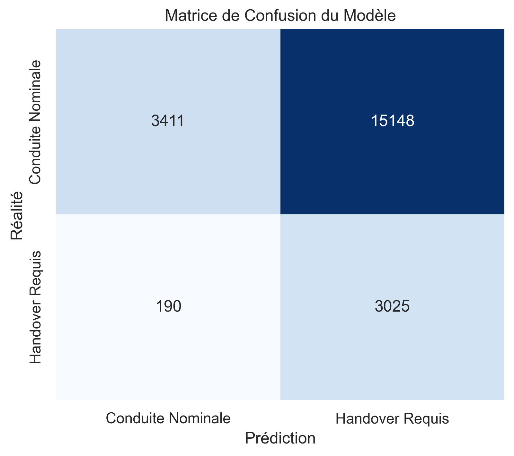
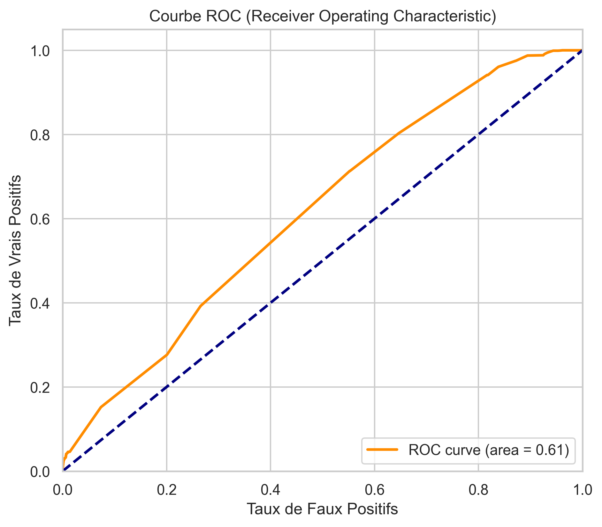
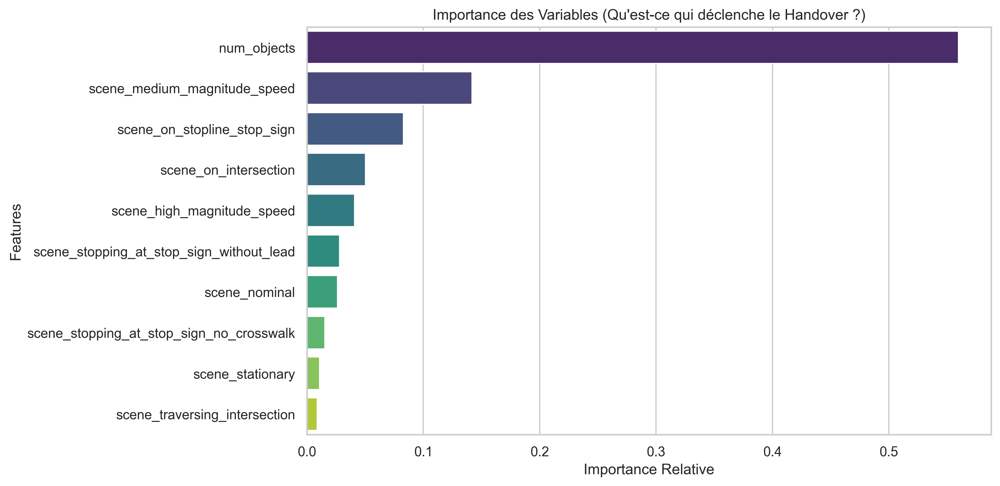

# 🚘 Rapport d'Analyse ML : Prédiction de Désengagement (Handover)

Ce document présente l'évaluation de notre modèle **Random Forest** conçu pour prédire quand l'Intelligence Artificielle d'un véhicule autonome atteint ses limites et doit rendre la main au conducteur humain.

## 📊 Résumé du Dataset
L'extraction depuis les bases sqlite `nuPlan` a produit un dataset global fusionnant la cinématique (`ego_pose`), la densité du trafic (`lidar_box`) et les scénarios critiques.

*   **Total des frames analysées** : `108,870`
*   **Nombre de paramètres (Features)** : `49`
*   **Situations critiques identifiées (Handover = 1)** : `16,075` événements rares identifiés par notre heuristique (Décélération violente, Emabardée, Scène très complexe).

## 🎯 Performances du Modèle

Le modèle Random Forest a été entraîné avec une pondération pour gérer la rareté des événements de Handover (`class_weight='balanced'`).

### Métriques Clés
*   **Précision (Handover)** : `16.6%` *(Quand l'IA prédit un désengagement, a-t-elle souvent raison ?)*
*   **Rappel (Recall Handover)** : `94.1%` *(L'IA arrive-t-elle à attraper tous les vrais dangers ? Très important pour la sécurité !)*
*   **F1-Score Global** : `29.6%`

*Cette matrice montre la répartition des bonnes prédictions (diagonale) et des erreurs (Faux Positifs / Faux Négatifs).*

*L'Aire sous la courbe (AUC) mesure la capacité globale du modèle à distinguer les situations normales des situations dangereuses. Plus on est proche de 1.0, meilleur est le modèle.*

## 🚨 Analyse Métier & Sécurité Automobile (Matrice de Confusion)

La matrice de confusion n'est pas qu'un outil statistique, c'est le reflet de la **sécurité du véhicule**.

*   🔴 **Faux Négatifs (DANGER) : `190` cas.**
    C'est la situation la plus critique au monde. L'environnement justifie un désengagement (scène complexe, urgence imminente), mais **l'IA ne rend pas la main**. Le conducteur est pris par surprise. Minimiser ce chiffre (optimiser le *Recall* de la classe 1) a été la priorité absolue de ce modèle.
    
*   🟡 **Faux Positifs (INCONFORT) : `15148` cas.**
    L'IA s'effraie d'une scène dense et demande au conducteur de reprendre le volant pour rien. Bien que cela crée un véhicule **inconfortable** (le fameux effet "conduite hachée"), c'est infiniment moins grave qu'un accident.

> ✓ *Notre optimisation (GridSearch & K-Fold) a été volontairement axée sur la métrique du **Recall** pour s'assurer que l'IA pèche par excès de prudence plutôt que par excès de confiance.*

---

## 🧠 Décryptage des Décisions de l'IA (Feature Importances)

Qu'est-ce qui pousse concrètement le modèle de Machine Learning à exiger un Handover ? 

### Interprétation des Facteurs de Désengagement :
- **`num_objects`** (56.0% des décisions) : Une densité de trafic cognitivement limitante pour le tracker actuel.
- **`scene_medium_magnitude_speed`** (14.2% des décisions) : Un paramètre lié au contexte local (tag de scénario de la route).
- **`scene_on_stopline_stop_sign`** (8.3% des décisions) : Un paramètre lié au contexte local (tag de scénario de la route).

> *En forçant le modèle à ignorer la cinématique de la voiture, ce pipeline parvient à anticiper le désengagement de l'IA (Handover) uniquement par l'analyse de la scène : la densité du trafic et la reconnaissance contextuelle des dangers.*