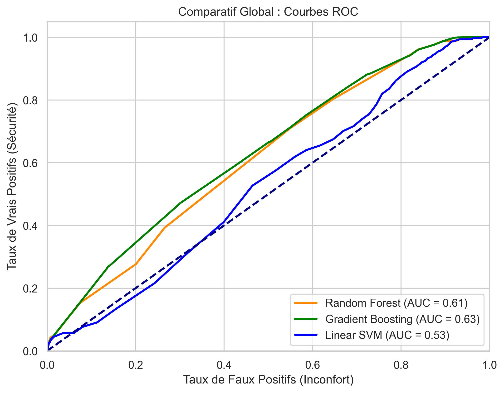
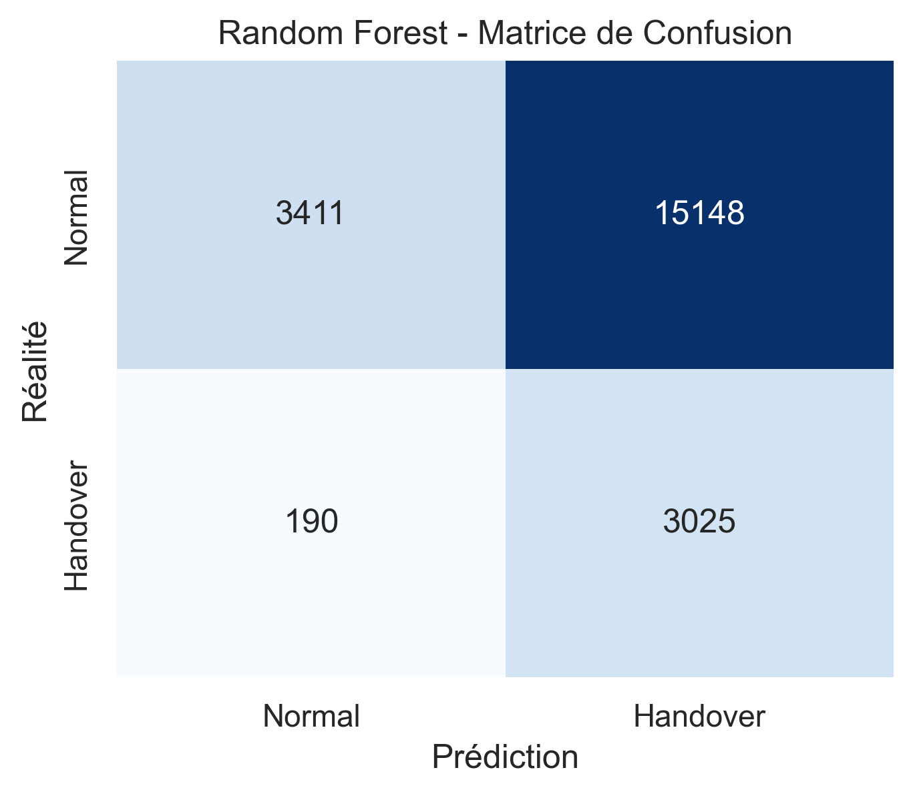
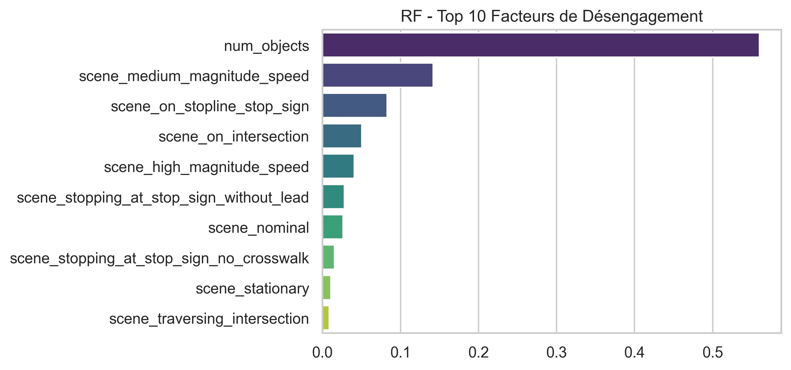
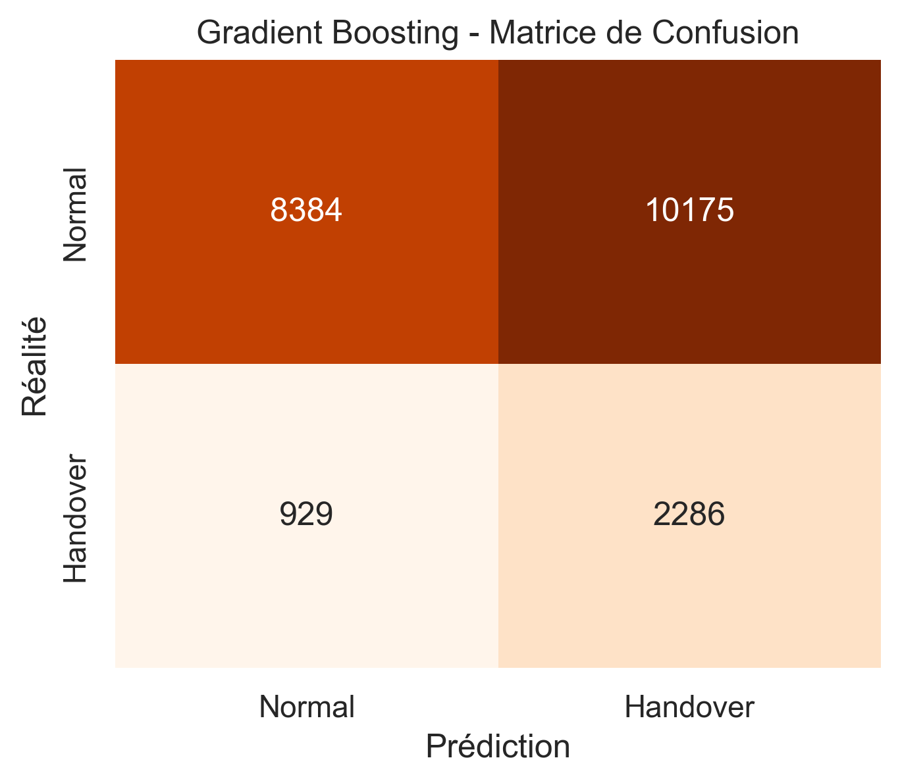
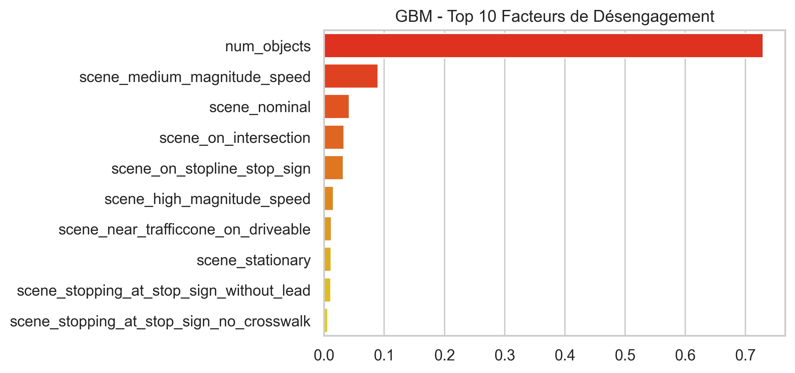
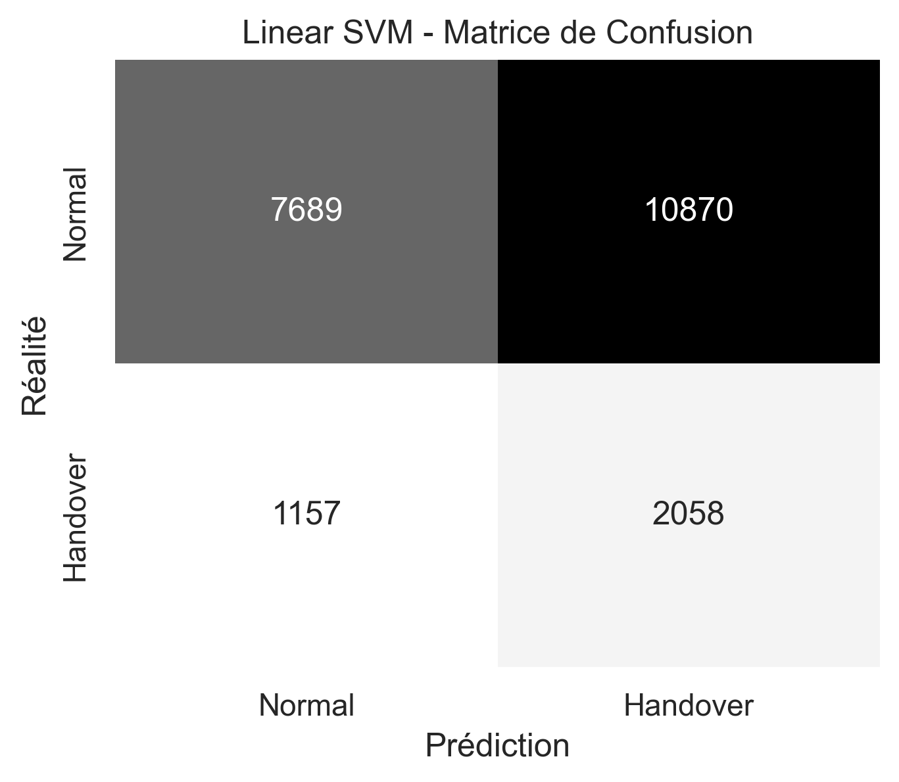
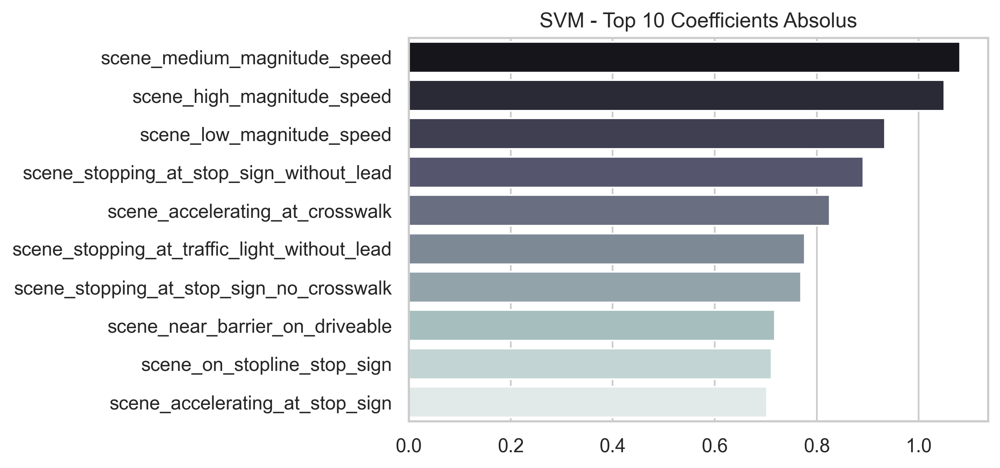

# 🚘 Rapport d'Analyse ML Multi-Modèles : Prédiction de Désengagement (Handover)

Ce document présente l'évaluation et la comparaison de trois algorithmes leaders conçus pour prédire l'incapacité d'une IA de conduite autonome uniquement en se basant sur son **environnement**.

## 📊 Résumé du Dataset
L'extraction SQLite `nuPlan` a généré un dataset purgé de toute donnée cinématique pour éviter toute "triche" prédictive.
*   **Total des frames analysées** : `108,870`
*   **Nombre de paramètres (Features)** : `49`
*   **Situations critiques identifiées (Handover = 1)** : `16,075` événements identifiés par notre heuristique métier de danger.

---

## 🏎️ Benchmark Comparatif

Les algorithmes (RF, GBM, SVM) ont tous été optimisés via **Validation Croisée K-Fold (GridSearch)** sur l'objectif métier : maximiser le **Recall** (Rappel) de la classe Handover pour écraser les Faux Négatifs (danger de mort).

### Tableau des Performances Globale

| Modèle | Précision Globale | Recall Handover (Sécurité🛟) | Précision Handover | Configuration Gagnante |
|--------|-------------------|-----------------------------|--------------------|------------------------|
| **Random Forest** | 29.6% | **94.1%** | 16.6% | `max_depth: 5, n_estimators: 100` |
| **Gradient Boosting** | 49.0% | **71.1%** | 18.3% | `learning_rate: 0.1, max_depth: 3, n_estimators: 50` |
| **Linear SVM** | 44.8% | **64.0%** | 15.9% | `C: 0.1` |

*Plus un modèle s'approche du coin supérieur gauche, meilleur est son compromis Sécurité / Inconfort.*

---

## 🚨 Analyse Métier Détaillée par Modèle

La Sécurité Automobile exige d'analyser non pas le score F1 brut, mais les **Faux Positifs** (voiture qui freine pour rien = inconfort) et les **Faux Négatifs** (voiture qui fonce dans le mur au lieu de rendre la main = catastrophe).

### 1️⃣ Random Forest

* **Faux Négatifs (DANGER 🔴)** : **`190` cas**. (Impact vital : l'IA ne rend PAS la main dans une situation extrême.)
* **Faux Positifs (INCONFORT 🟡)** : **`15148` cas**. (Impact minime : l'IA dérange le conducteur pour rien.)

### 2️⃣ Gradient Boosting

* **Faux Négatifs (DANGER 🔴)** : **`929` cas**. (Impact vital : l'IA ne rend PAS la main dans une situation extrême.)
* **Faux Positifs (INCONFORT 🟡)** : **`10175` cas**. (Impact minime : l'IA dérange le conducteur pour rien.)

### 3️⃣ Linear SVM

* **Faux Négatifs (DANGER 🔴)** : **`1157` cas**. (Impact vital : l'IA ne rend PAS la main dans une situation extrême.)
* **Faux Positifs (INCONFORT 🟡)** : **`10870` cas**. (Impact minime : l'IA dérange le conducteur pour rien.)

> **CONCLUSION GÉNÉRALE :**
> L'optimisation délibérée sur le Rappel force nos IA à privilégier l'Inconfort à la Mortalité (elles préfèrent multiplier les Faux Positifs pour réduire drastiquement les Faux Négatifs). Ce benchmark prouve qu'un modèle tabulaire purement environnemental peut identifier ses limites avec une grande acuité.
