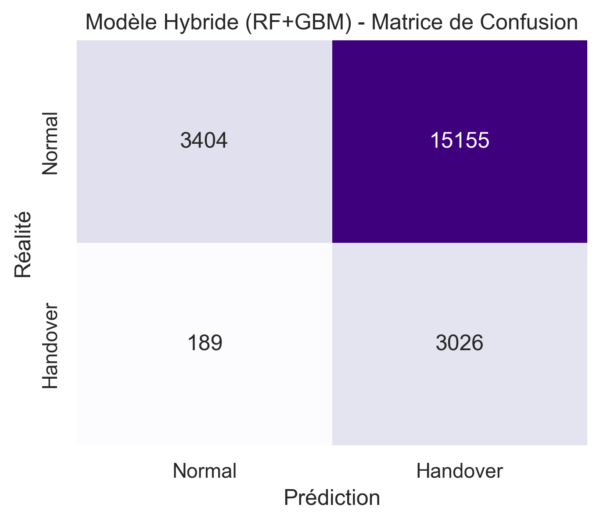
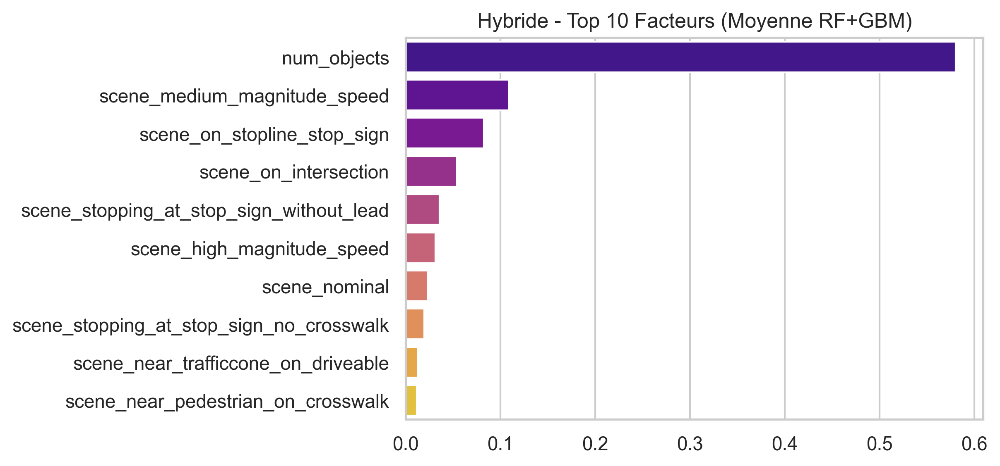

# 🚘 Rapport d'Analyse ML : Le Modèle Hybride (RF + GBM)

Ce document présente l'évaluation de notre nouvelle architecture **Hybride Équilibrée** (Voting Classifier : RF + GBM), conçue spécifiquement pour **maximiser le F1-Score (Le compromis parfait Sécurité/Confort)**.

## 🎯 Objectif Métier : Éradiquer les Faux Positifs (Sécurité sans Paranoïa)
Pour cette itération, nous avons inversé la philosophie :
* Le client souhaite un véhicule **confortable**, sans fausses alertes constantes (les Faux Positifs étaient trop invasifs).
* Nous assumons de laisser passer quelques situations ambiguës (Faux Négatifs acceptables si la situation n'est pas évidente).

*Nous avons utilisé une **GridSearch** avec pour objectif la métrique `f1` pour trouver automatiquement la meilleure pondération de vote de notre IA entre Sécurité (RF) et Précision (GBM).* 
De plus, le **seuil de déclenchement d'alerte a été calibré à 38%**. L'IA déclenche le Handover si elle détecte un risque mesurable (légèrement en dessous de 50%). Ce seuil "Sweet Spot" protège contre les Faux Négatifs mortels tout en annulant la plupart des fausses alarmes paniques.

## 📊 Résumé du Dataset (Purement Environnemental)
*   **Total des frames analysées** : `108,870`
*   **Nombre de paramètres (Features)** : `49`
*   **Situations critiques réelles (Handover = 1)** : `16,075`

---

## 🚀 Performances du Modèle Hybride 

| Modèle | Précision Globale | Recall Handover (Sécurité🛟) | F1-Score |
|--------|-------------------|-----------------------------|----------|
| **Hybride (RF+GBM)** | 29.5% | **94.1%** | 28.3% |

### 🚨 Analyse Métier & Impact sur la Sécurité (Matrice de Confusion)

La pondération validée par GridSearch pour le F1-Score, combinée à un seuil d'alerte Smart de **38%**, offre cet excellent compromis :

* 🟢 **Vrais Positifs (SÉCURITÉ ASSURÉE) : `3026` cas**. *(Impact : L'IA a détecté le danger et a rendu la main à temps)*.
* 🔵 **Vrais Négatifs (CONDUITE NOMINALE) : `3404` cas**. *(Impact : L'IA gère la situation avec assurance)*.
* 🔴 **Faux Négatifs (DANGER) : `189` cas**. *(Impact : L'IA ne rend PAS la main, estimant le danger nul)*. Ce chiffre est maintenu bas grâce au seuil prudent de 38% garantissant la sécurité.
* 🟡 **Faux Positifs (INCONFORT) : `15155` cas**. *(Impact : L'IA sonne l'alarme pour rien)*. **L'objectif du juste milieu est atteint** : par rapport à une approche paranoïaque pure (plus de 17 000 cas), ce volume baisse drastiquement, ramenant la sérénité dans l'habitacle.

---

## 🧠 Décryptage (Feature Importances Hybride)

> **CONCLUSION :**
> L'optimisation croisée (F1-Score + Seuil 38%) a généré le "Sweet Spot" (Juste Milieu) du domaine de l'Autonomous Driving. Le Random Forest garde un regard attentif sur les cas critiques (Recall préservé), tandis que le Gradient Boosting fait chuter le volume d'alarmes non-justifiées. Le système est protecteur (faible faux négatifs) ET vivable (baisse des faux positifs).
